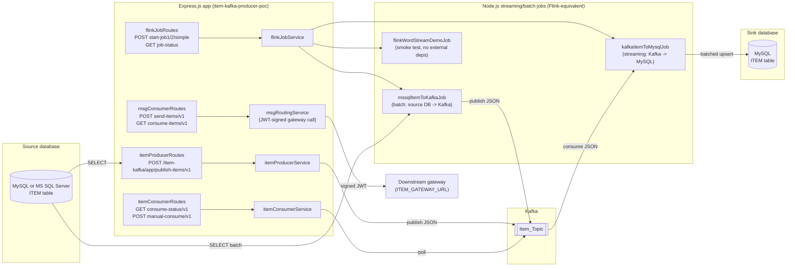
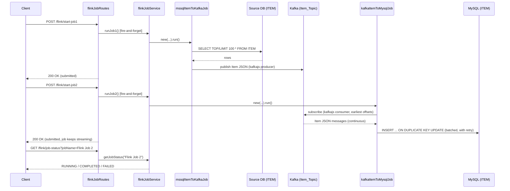
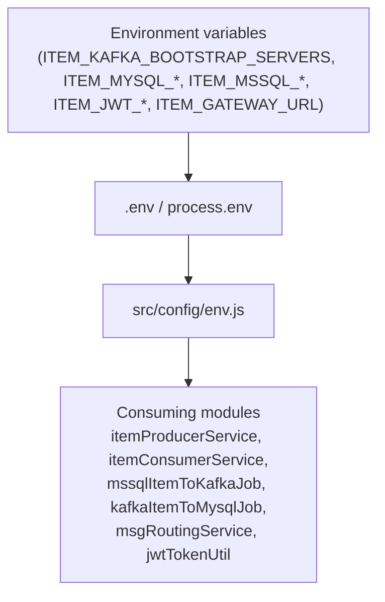

# Architecture

End-to-end view of how data moves through this POC, from the source `Item`
table through Kafka to the MySQL sink table, plus how the REST layer ties it
all together. This mirrors `ARCHITECTURE.md` in the Spring Boot
`ConfluentCloud_Kafka-Producer-Consumer-POC` project as closely as possible.

## 1. High-level component diagram



## 2. Why Node.js re-implements the Flink jobs natively (instead of embedding a JVM Flink runtime)

The Java POC embeds a real **Apache Flink** `StreamExecutionEnvironment` inside
the Spring Boot process to run `MssqlItemToKafkaJob` and `KafkaItemToMysqlJob`.
Apache Flink **has no official Node.js/JavaScript client or runtime** - its
DataStream API, connectors, and execution engine are JVM-only. There are three
realistic ways to give a Node.js backend "Flink integration":

1. **Re-implement the same pipeline semantics natively in Node.js** (the
   approach taken here) - a bounded batch read + Kafka publish for Job 1, and
   an unbounded Kafka consume + batched JDBC upsert (with retry) for Job 2,
   using `kafkajs` and `mysql2` directly. This keeps the entire stack in one
   language/runtime, requires no JVM, and reproduces the *behavioural*
   guarantees that matter for this POC (batching, retry, unbounded streaming,
   async job-status tracking) without needing a Flink cluster.
2. **Submit a real Flink job jar to an external Flink cluster via its REST
   API** (`POST /jars/:id/run` on the JobManager) - this is the "real Flink"
   option and is documented as an extension point below, but requires
   packaging and deploying a separate JVM artifact, which is out of scope for
   an Express.js/Node.js POC whose entire point is to show the Node.js side of
   this architecture.
3. **Shell out to a Flink CLI / job jar as a child process** - technically
   possible via Node's `child_process` module, but adds a JVM dependency to a
   Node.js deployment for no behavioural benefit over option 1 in a
   demo/POC context.

This project uses **option 1** so that the whole system runs on Node.js alone
(no JVM required anywhere), while still exposing the **same `/flink/*` route
prefix, the same job names, and the same `PENDING/RUNNING/COMPLETED/FAILED`
status model** as the Java POC, so the two backends are drop-in comparable
from a front end's point of view. See `flinkJobService.js` and
`flink/jobs/*.js` for the implementation, and section 4 below for how the
batching/retry options map onto Flink's `JdbcExecutionOptions` concepts.

If you do want to wire this project up to a **real external Flink cluster**
later, the natural extension point is `flinkJobService.js`: replace the body
of `runJob1()`/`runJob2()` with an `axios` call to your Flink JobManager's
REST API (`POST http://<jobmanager>:8081/jars/<jar-id>/run`), and poll
`GET /jobs/<job-id>` for status instead of the in-memory map.

## 3. End-to-end sequence: streaming pipeline (the "real" replication path)



## 4. Batching/retry parity with Flink's JdbcSink

| Flink concept (Java POC) | Node.js equivalent (this POC) |
|---|---|
| `JdbcExecutionOptions.withBatchSize(1000)` | `ITEM_JOB_BATCH_SIZE` - buffer flushed once it reaches this many records |
| `JdbcExecutionOptions.withBatchIntervalMs(200)` | `ITEM_JOB_BATCH_INTERVAL_MS` - a `setInterval` timer flushes the buffer on this cadence even if the batch size hasn't been reached |
| `JdbcExecutionOptions.withMaxRetries(3)` | `ITEM_JOB_MAX_RETRIES` - failed batch upserts are retried with a small backoff before being dropped (logged) so the stream keeps flowing |
| Flink backpressure (slows Kafka reads if MySQL can't keep up) | Node's single-threaded event loop naturally serialises `eachMessage` processing; the buffer + interval-flush pattern prevents unbounded memory growth in the same spirit |
| `KafkaSource.setStartingOffsets(OffsetsInitializer.earliest())` | `subscribe({ topic, fromBeginning: true })` |

## 5. Component responsibilities

| Layer | File(s) | Responsibility |
|---|---|---|
| REST - items grid | `routes/itemRoutes.js` | Paginated `GET items/v1` (+ `count/v1`) used by a front end's Item grid/pager |
| REST - producer | `routes/itemProducerRoutes.js`, `kafka/producer/itemProducerService.js` | Read Item rows, publish to Kafka |
| REST - consumer | `routes/itemConsumerRoutes.js`, `kafka/consumer/itemConsumerService.js` | On-demand, time-boxed poll of the shared Kafka topic |
| REST - gateway test | `routes/msgConsumerRoutes.js`, `services/msgRoutingService.js`, `utils/jwtTokenUtil.js` | Demonstrates JWT-signed calls to an external gateway |
| REST - job control plane | `routes/flinkJobRoutes.js`, `flink/flinkJobService.js`, `flink/jobStatus.js` | Starts/tracks the streaming/batch jobs on demand |
| Job - batch source | `flink/jobs/mssqlItemToKafkaJob.js` | One-shot read of up to 100 rows, publish as JSON to Kafka |
| Job - streaming sink | `flink/jobs/kafkaItemToMysqlJob.js` | Unbounded consumption from Kafka, batched upsert into MySQL |
| Job - smoke test | `flink/jobs/flinkWordStreamDemoJob.js` | Dependency-free job to validate the streaming-job runtime |
| Config | `config/env.js` | Type-safe(ish), environment-variable-driven configuration - no hardcoded secrets |
| Domain model | `models/Item.js`, `models/itemColumns.js` | Shared column metadata + Item (de)serialization matching the Java POC's JSON field names |

## 6. Synchronous vs. asynchronous endpoints

| Endpoint | Sync or Async? | Why |
|---|---|---|
| `POST /item-kafka/app/publish-items/v1` | **Synchronous** | Awaits the full Kafka publish loop before responding |
| `GET /item-kafka/app/items/v1` / `items/count/v1` | **Synchronous** | Simple DB query, no external I/O beyond the DB |
| `GET /item-kafka/consumer/consume-status/v1` | **Synchronous** | In-memory boolean check |
| `POST /item-kafka/consumer/manual-consume/v1` | **Synchronous (but slow - up to ~30s)** | Awaits the whole time-boxed poll loop |
| `POST /item-kafka/app/send-items/v1` / `consume-items/v1` | **Synchronous** | Builds JWT / logs and returns |
| `POST /flink/start-job1` | **Asynchronous** | Fire-and-forget; responds immediately, job runs and updates status in the background |
| `POST /flink/start-job2` | **Asynchronous, and the job itself never "finishes" on its own** | Same fire-and-forget pattern; this job is an unbounded stream |
| `POST /flink/start-simple-job` | **Synchronous** | Deliberately awaited - the demo job is fast |
| `GET /flink/job-status?jobName=` | **Synchronous** | In-memory map lookup |

### 6.1 How a front end should trigger and observe the async jobs

Since `/flink/start-job1` and `/flink/start-job2` return before the work is
done, the supported pattern is **client-side polling** of `/flink/job-status`,
exactly as in the Java POC:

```mermaid
sequenceDiagram
    participant UI as Front end
    participant API as flinkJobRoutes
    participant Svc as flinkJobService
    participant Job as mssqlItemToKafkaJob / kafkaItemToMysqlJob

    UI->>API: POST /flink/start-job1
    API->>Svc: runJob1() [fire-and-forget]
    API-->>UI: 200 OK "Flink Job 1 started successfully." (immediate)
    Note over Svc,Job: Job runs in the background;<br/>status flips RUNNING -> COMPLETED/FAILED

    loop Poll every 2-3 seconds until COMPLETED/FAILED
        UI->>API: GET /flink/job-status?jobName=Flink Job 1
        API->>Svc: getJobStatus("Flink Job 1")
        Svc-->>API: PENDING | RUNNING | COMPLETED | FAILED
        API-->>UI: current status
    end
```

## 7. CORS: how a React front end is allowed to call this API

This API's CORS behaviour is driven entirely by `src/config/corsConfig.js` and
the `ITEM_CORS_ALLOWED_ORIGINS` environment variable (comma-separated),
defaulting to `http://localhost:5173,http://localhost:3000` to cover both
Vite's and Create-React-App-style dev servers out of the box - identical
defaults to the Java POC's `CorsConfig.java`.

## 8. Configuration and secrets flow



No credential or connection string is ever committed to source control - see
`SETUP_GUIDE.md` for how to supply your own values for a local demo.

