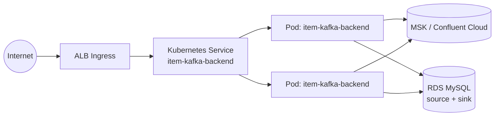

# EKS Deployment Guide

Full walkthrough for deploying `ExpressJS-Kafka-Producer-Consumer-POC` to
Amazon EKS. For the condensed copy/paste version, see
`AWS_QUICKSTART_CHEATSHEET.md`.

## 1. Architecture on AWS



## 2. Prerequisites

- An AWS account with permissions to create EKS, ECR, RDS, MSK, ALB, IAM resources
- `aws`, `kubectl`, `eksctl`, `docker` CLIs installed locally
- The AWS Load Balancer Controller add-on installed in your cluster (needed for `k8s/backend-ingress-alb.yaml`)

## 3. Provision the data layer

### RDS MySQL

- Create an RDS MySQL 8.x instance (or two, one for source + one for sink, or one instance with two databases).
- Run the scripts in `sql-scripts/` against it (see `DATABASE_SETUP.md`).
- Note the endpoint hostname for `ITEM_MYSQL_SOURCE_HOST` / `ITEM_MYSQL_HOST`.

### MSK (or Confluent Cloud)

- Create an MSK cluster (or use an existing Confluent Cloud cluster).
- Note the bootstrap broker string for `ITEM_KAFKA_BOOTSTRAP_SERVERS`.
- If your MSK cluster uses TLS/SASL, extend `src/kafka/kafkaClient.js` accordingly (see `KAFKA_SETUP.md`).

## 4. Build and push the image

```powershell
docker build -t item-kafka-backend-express .
# tag + push to ECR - see AWS_QUICKSTART_CHEATSHEET.md section 2
```

## 5. Create the EKS cluster

```powershell
eksctl create cluster --name item-kafka-poc-express --region af-south-1 --nodes 2 --node-type t3.medium
aws eks update-kubeconfig --name item-kafka-poc-express --region af-south-1
```

## 6. Configure and apply Kubernetes manifests

Edit `k8s/backend-configmap.yaml` with your real (non-secret) settings, and
create `k8s/backend-secret.yaml` from `k8s/backend-secret.example.yaml` with
your real credentials (never commit the filled-in secret file).

```powershell
kubectl apply -f k8s\namespace.yaml
kubectl apply -f k8s\backend-configmap.yaml
kubectl apply -f k8s\backend-secret.yaml
kubectl apply -f k8s\backend-deployment.yaml   # update the image: field first!
kubectl apply -f k8s\backend-service.yaml
kubectl apply -f k8s\backend-hpa.yaml
kubectl apply -f k8s\backend-ingress-alb.yaml
```

## 7. Validate

```powershell
kubectl get pods -n item-kafka-poc-express
kubectl get ingress -n item-kafka-poc-express
curl "http://<alb-hostname>/actuator/health"
curl "http://<alb-hostname>/agent/swagger-ui.html"
```

## 8. Point DNS at the ALB

Create a CNAME/ALIAS record for your domain pointing at the ALB Ingress
hostname from step 7, then update `k8s/backend-ingress-alb.yaml`'s `host:`
value to match and re-apply.

## 9. Scaling

`k8s/backend-hpa.yaml` scales the Deployment between 2 and 6 replicas based
on CPU utilization (target 70%). Adjust `minReplicas`/`maxReplicas` and the
resource requests/limits in `k8s/backend-deployment.yaml` to match your load.

Note: `POST /flink/start-job2` starts an **unbounded Kafka consumer** inside
whichever pod handles the request. If you run multiple replicas, each replica
that receives a `start-job2` call will run its own consumer instance in the
same consumer group (`ITEM_KAFKA_CONSUMER_GROUP`) - Kafka will automatically
balance partitions across them, which is the desired behaviour for horizontal
scale-out of the streaming job.

## 10. Cleanup

See section 10 of `AWS_QUICKSTART_CHEATSHEET.md`.

